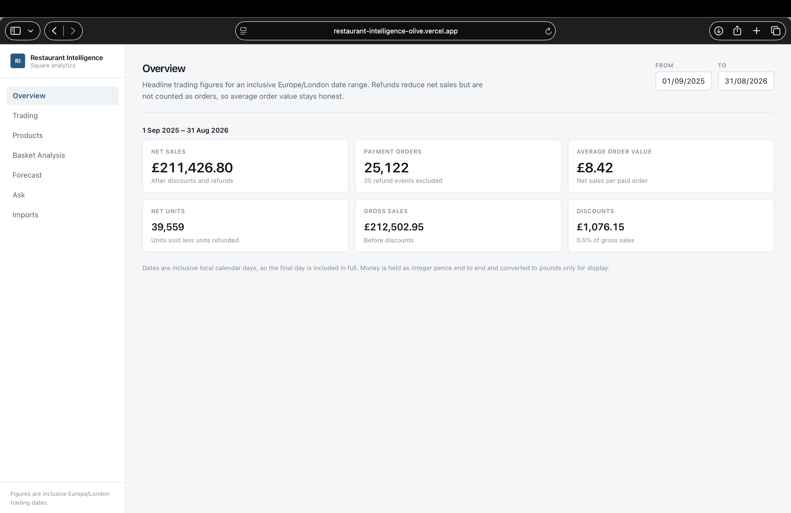
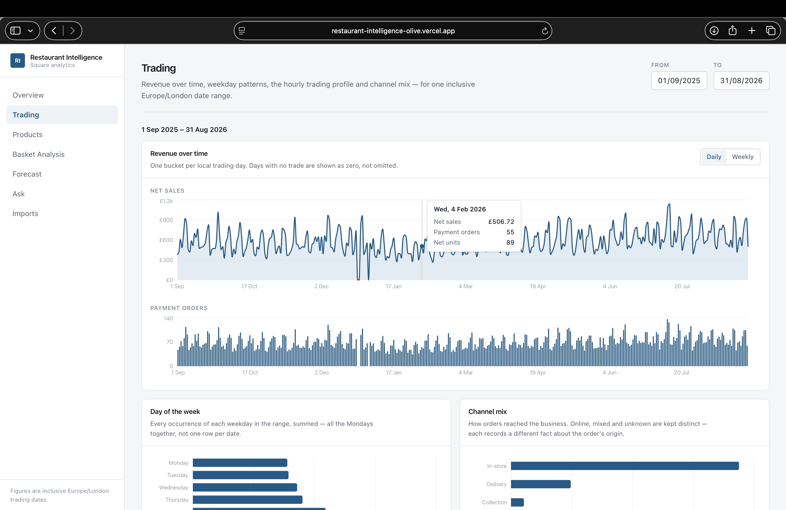
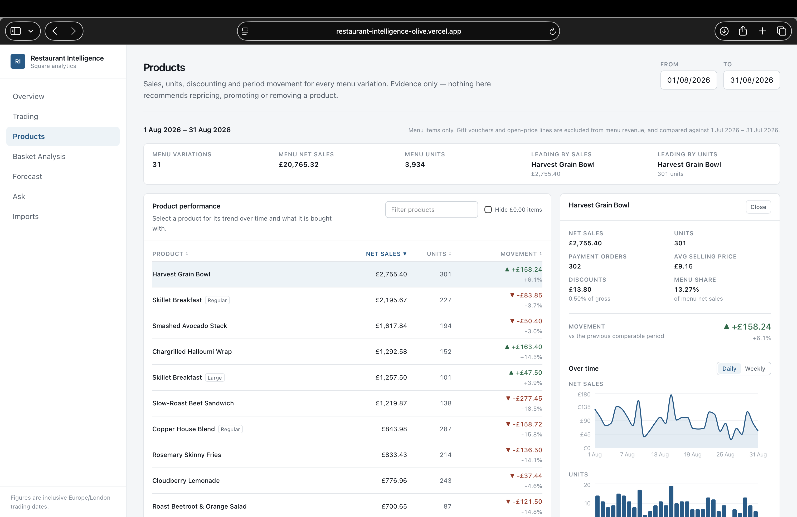
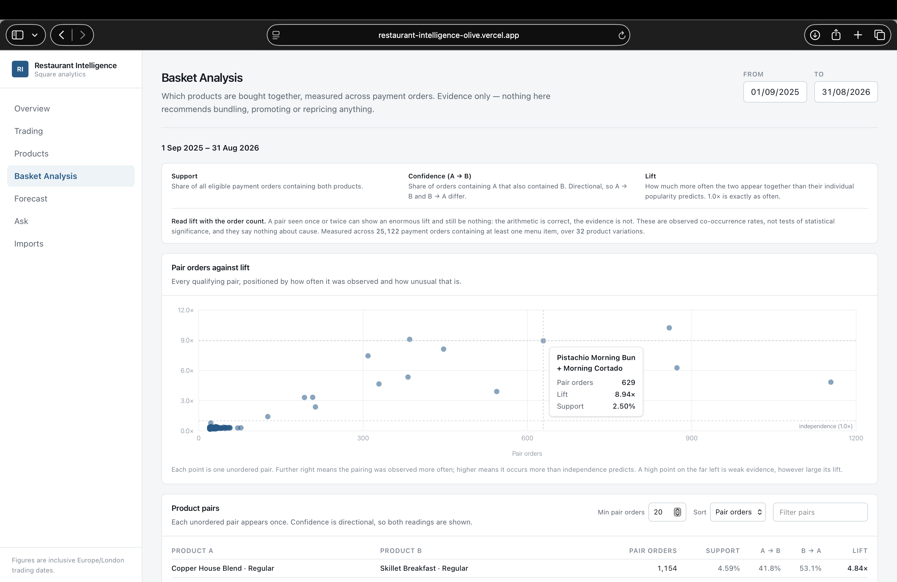
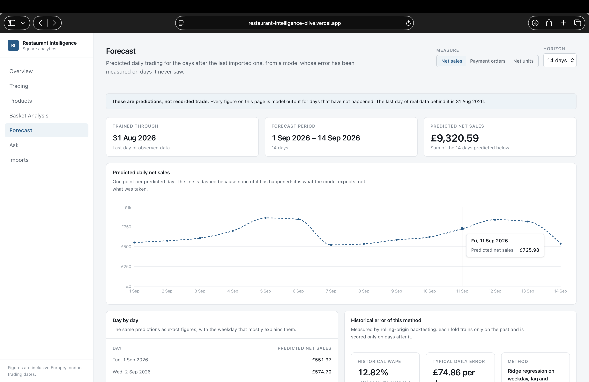
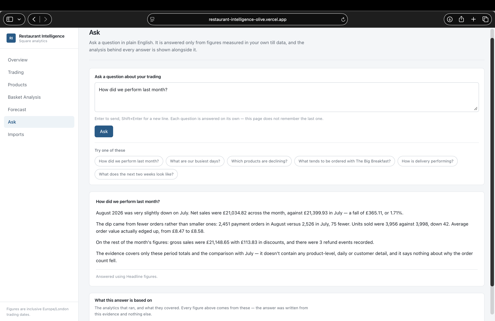
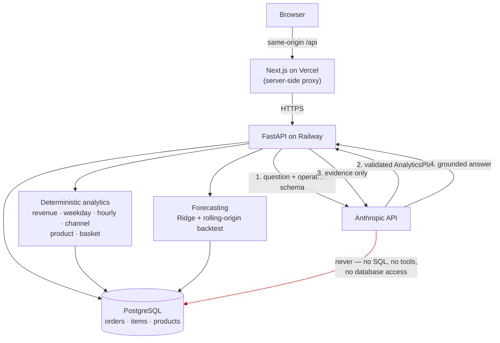

# Restaurant Intelligence

Turns a café's raw Square point-of-sale exports into reconciled trading
analytics, a backtested sales forecast, and natural-language answers that can
only quote figures the system actually measured.

### ▶ [**Live demo — restaurant-intelligence-olive.vercel.app**](https://restaurant-intelligence-olive.vercel.app)

> **The live demo runs on a deterministic synthetic dataset for a fictional
> café ("The Copper Kettle").** Every product, price and transaction in it is
> generated by [a committed generator](backend/scripts/generate_public_demo.py)
> from a fixed seed. It contains no real business, customer or payment data —
> but it is ingested, reconciled and analysed by exactly the same pipeline as a
> genuine Square export, so what you see is the real system, not a mock.

Next.js on Vercel · FastAPI on Railway · Railway PostgreSQL · Anthropic API
· Python 3.12 / TypeScript · 1,281 tests

---

## What it does

**Ingests real Square exports.** Square names its exports `.csv`, but they are
UTF-16, tab-delimited files that a normal CSV reader turns into a single column
of garbage. The format is asserted and a wrong file is rejected with a reason.
Every upload is checksummed for idempotency, imports are atomic, and totals are
**reconciled against Square's own Items Summary** on three independent
measures — a mismatch fails the import rather than storing figures that match
no source file.

**Trading analytics.** Revenue over time, weekday patterns, an hourly heatmap
and channel mix, all computed over inclusive Europe/London calendar days.

**Product and menu performance.** Per-variation sales, units, discounting and
period-over-period movement. "Regular" and "Large" are different products at
different prices and are never merged.

**Basket analysis.** Co-purchase pairs with support, directional confidence and
lift, measured across distinct payment orders.

**Forecasting.** Ridge regression on calendar and lag features, predicting the
next 14 days, with its error measured by rolling-origin backtesting on days it
never trained on.

**Grounded natural-language analytics.** Ask a question in plain English. A
language model plans which analytics to run from a closed whitelist; the
backend executes them deterministically; the model then writes an answer from
that evidence and nothing else. **It never queries the database.**

---

## What it looks like

### Overview — headline trading for any date range

A full synthetic year at a glance: £211,426.80 net sales across 25,122 payment
orders. Refunds reduce net sales but are excluded from the order count, so
average order value stays honest. Money is held as integer pence end to end and
converted to pounds only for display.

### Trading — when the business actually trades

Daily net sales and order volume with a weekly rhythm visible, plus weekday
totals and channel mix. Days with no trade are drawn as explicit zeros rather
than omitted — the closed days over Christmas are visible as genuine gaps in
the line, not missing data.

### Products — performance and movement per menu variation

Every variation ranked, with movement against the comparable previous period.
Selecting a product opens its trend and its share of menu revenue. Note
*Skillet Breakfast* appearing as both **Regular** and **Large** — the same
distinction the Ask page uses to demonstrate clarification.

### Basket Analysis — what sells alongside what

Each point is one unordered pair, positioned by how often it was observed and
how unusual that is. The page states the caveat rather than hiding it: a pair
seen twice can show enormous lift and mean nothing, so lift is always read
beside the order count.

### Forecast — predictions, labelled as predictions

Fourteen predicted days from the last imported one. The line is dashed because
none of it has happened, the banner says so, and the method's **historical
WAPE of 12.82%** is reported as measured past error — not as an accuracy claim
about these particular numbers.

### Ask — grounded natural-language analytics

A plain-English question, answered only from measured evidence. The answer
quotes August against July, then states what the evidence does *not* cover —
and "What this answer is based on" lists the analytics that ran, so every
figure is checkable.

---

## Try the live demo

**[restaurant-intelligence-olive.vercel.app](https://restaurant-intelligence-olive.vercel.app)**
— no login, nothing to install.

1. **Overview / Trading** — the default range is the full year, 1 Sep 2025 to
   31 Aug 2026. Look for the weekend peaks and the December closures.
2. **Products** — sort by movement to see which items are rising and falling.
3. **Basket Analysis** — hover the scatter; the strongest pairs sit far right
   *and* high.
4. **Forecast** — the 14-day horizon, with its backtested error underneath.
5. **Ask → "How did we perform last month?"** — a period comparison, answered
   from headline evidence.
6. **Ask → "What does the next two weeks look like?"** — the answer is a
   forecast, and is flagged as prediction from the evidence rather than from
   the model's wording.
7. **Ask → "How is the Skillet Breakfast doing?"** — this **deliberately**
   returns a clarification. Skillet Breakfast exists as *Regular* and *Large*,
   the resolver refuses to guess which you meant, and the UI offers both rather
   than silently picking the bigger seller.

An answer takes roughly 8–15 seconds: one model call to plan, the analytics
themselves, then one call to write the answer.

---

## The demo dataset

Generated by [`backend/scripts/generate_public_demo.py`](backend/scripts/generate_public_demo.py)
from **seed `424242`**, then imported through the real importer as twelve
monthly batches.

| | |
|---|---|
| Period | 1 Sep 2025 – 31 Aug 2026 · **365 observed days** |
| Payment orders | **25,122** |
| Net units | **39,559** |
| Net sales | **£211,426.80** (gross £212,502.95, discounts £1,076.15) |
| Refund events | **35** |
| Import batches | **12 monthly batches, all reconciled exactly** |
| Catalogue | 34 variations — 32 menu items, one gift voucher, one open-price line |
| Channels | in-store, collection, delivery, online and mixed |

The generator deliberately encodes structure so the analytics have something
real to find: strong basket pairs, four products in clear growth and four in
clear decline, one product introduced in month four and one withdrawn in month
nine, a weekend-heavy weekly cycle with breakfast and lunch peaks, and three
explicit closed days. Re-running it produces byte-identical files.

---

## Architecture



The model sits **outside** the data path. It receives a question and a schema
of permitted operations, and returns a plan. The plan is validated and executed
by ordinary Python; the resulting evidence is the model's entire factual input
when it writes the answer. It is never handed a database session, a tool, or
the ability to express a query.

---

## Grounded AI: how the answer is kept honest

```
question  →  LLM planner  →  AnalyticsPlan (≤ 4 whitelisted operations)
          →  Pydantic validation
          →  deterministic executor  →  EvidenceBundle[]
          →  LLM answer generator (evidence is its only input)
          →  answer + the evidence behind it
```

- **A closed operation set.** Twelve operations — overview, revenue over time,
  weekday, peak hours, channel mix, product performance, movers, product trend,
  attachments, basket pairs, menu evidence, forecast. There is no generic
  fallback and no free-text field anywhere in the contract.
- **Pydantic validates every plan.** Each step reuses the same request schema
  the HTTP API uses, `extra="forbid"` throughout. A plan naming an unknown
  operation, smuggling an `sql` field, or exceeding a parameter bound is
  rejected before a database session is opened. A model that complies fully
  with a prompt injection still produces a plan that fails validation.
- **Ambiguity is surfaced, not guessed.** Product names match exactly, case-
  and whitespace-insensitively. "Skillet Breakfast" matches two variations, so
  the API returns candidates and the UI asks which you meant.
- **Forecasts are labelled as predictions** — derived from the evidence, not
  from the answer's wording, so a prediction is flagged even if the prose
  forgets to.
- **The browser never receives the provider API key.** It calls this
  application's own same-origin `/api` path; the key lives only in the
  backend's environment and appears in no prompt and no client bundle.
- **Without a key the feature degrades alone.** `/analytics/ask` returns a
  503 that explains itself; every other page works unchanged.

Full design rationale, including the prompt-injection analysis, is in
[ARCHITECTURE.md §7](ARCHITECTURE.md).

---

## Forecasting

**Ridge regression** on 13 features: weekday one-hot, lags at 7/14/21/28 days,
trailing 7- and 28-day means, and a fixed-date holiday flag. It predicts the
next **14 days recursively** from the last imported day — not from the wall
clock, because forecasting past the data would treat unimported days as
closures.

**Evaluated by rolling-origin backtesting**, which is leakage-safe by
construction: each fold trains only on days before its origin and is scored
only on days after it. On the demo dataset that is **17 folds × 14 days = 238
previously unseen forecast days**.

On those unseen days the method's **WAPE is 12.82%**, with a typical daily
error of £74.86.

> **WAPE is measured past error, not accuracy.** A WAPE of 12.82% does not mean
> the forecast is "87% accurate", and nothing here converts it into one. It
> describes how wrong this method has been on days it had never seen.

**No prediction intervals are produced.** Publishing one would mean validating
its coverage, which has not been done — and an unvalidated interval invites
trust in a range nobody has checked.

Baselines, the evaluation method and the honest margin over them are in
[ARCHITECTURE.md §6](ARCHITECTURE.md).

---

## Engineering highlights

The parts worth reading the code for.

**Money is integer pence, end to end.** Never a float, from the adapter's
decimal-safe parsing through aggregation to the API boundary. Pounds exist only
in the UI's formatter.

**Europe/London, DST-aware.** A user's "August" means 1–31 August as the till
saw it; the database stores UTC instants. The half-open conversion
(`>= local_midnight(start)`, `< local_midnight(end + 1 day)`) lives in one
module, because comparing `occurred_at <= end_date` silently discards almost
the whole final day, and a fixed UTC offset breaks twice a year.

**Idempotent, atomic imports with independent reconciliation.** Files are
checksummed before anything is written; an overlapping order is compared
field-by-field and either skipped or fails the whole import; and imported
totals must match Square's own Items Summary on net sales, line totals and unit
counts. Any failure rolls back every sales-data change.

**Set-based analytics, no N+1.** The menu-evidence view joins performance,
period movement and co-purchase for the whole catalogue in a fixed five
statements regardless of how many products exist — deliberately not "list
products, then query each one".

**Leakage-safe forecasting.** Rolling-origin folds, features computed only from
history strictly before each prediction, and a baseline that is not a strawman.

**A whitelist the model cannot escape.** The AI layer imports `sqlalchemy` in
exactly one module (product-name lookup) and `sqlalchemy.text` in none; it calls
no `eval`, `exec` or dynamic attribute lookup. These are asserted against the
parsed source, not just by trying inputs.

**Provider schema compatibility with a safe fallback.** The provider's
structured-output engine rejects several JSON Schema keywords and will not
compile a twelve-operation union into a grammar. The adapter sanitises the
schema, moves dropped bounds into field descriptions, and falls back to
carrying the schema in the prompt — remembering the refusal so it costs one
round trip per process. Safety is unaffected: the plan was always validated by
Pydantic afterwards.

**Same-origin API proxy.** The browser only ever talks to its own origin, so
there is no CORS policy to keep correct across environments and the backend
stays unaware that a browser exists.

**Deployment hardening.** Managed Postgres hands out a generic `postgresql://`
URL, which SQLAlchemy resolves to psycopg2 — a driver this project does not
install. The URL is normalised onto psycopg 3 as it enters the application, so
the runtime engine and Alembic can never disagree about the driver.

**An isolated, destructive-by-design test database.** The suite truncates every
sales table and downgrades the schema to base, so it refuses to run unless
`TEST_DATABASE_URL` names a database ending in `_test`, and never falls back to
`DATABASE_URL`.

---

## Tech stack

**Backend** — Python 3.12, FastAPI, SQLAlchemy 2, Alembic, psycopg 3,
Pydantic 2, scikit-learn, Anthropic SDK.
**Frontend** — Next.js 16 (App Router), React 19, TypeScript, Tailwind,
Recharts, Vitest.
**Infrastructure** — PostgreSQL 16, Docker Compose, GitHub Actions;
deployed on Vercel (frontend) and Railway (API + database).

`pandas` is deliberately absent: the forecasting series is at most 366 rows of
six integers, already assembled as dataclasses, and a DataFrame would add a
large dependency and a silent float coercion of integer pence for nothing.

---

## Run it locally

Requires Docker Desktop.

```bash
cp .env.example .env
docker compose up -d --wait
```

The dashboard is on <http://localhost:3000>, the API on
<http://localhost:8000>, interactive docs at
<http://localhost:8000/docs>.

Import the small committed sample to see the importer work:

```bash
./scripts/demo_import.sh
```

### Generate and load the full demo year

```bash
docker compose exec api python scripts/generate_public_demo.py
```

```bash
docker compose exec api python scripts/load_public_demo.py --reset
```

The first writes 36 files (12 monthly batches × 3 exports) to
`backend/data/public-demo/`, which is gitignored — the generator is committed,
its output is not. The second loads them through the real importer and prints
each month's reconciliation.

> **The loader will not touch your working data.** It writes only to a database
> whose name ends in `_demo` (`restaurant_intelligence_demo`, created on first
> run), and refuses any other target — including one identical to
> `DATABASE_URL`:
>
> ```
> REFUSED: refusing to load demo data into database 'restaurant_intelligence':
> the name must end with '_demo'.
> ```

Point the API at it with `DATABASE_URL=…/restaurant_intelligence_demo` to browse
the demo year locally.

### Optional: enable the Ask page

```bash
# in .env — without it every other page works unchanged
ANTHROPIC_API_KEY=sk-ant-...
```

---

## Tests

```bash
docker compose exec api python -m pytest      # 970 backend tests
docker compose exec web npm test              # 311 frontend tests
```

The backend suite runs against a dedicated `_test` database and refuses to run
anywhere else. The frontend suite never makes a network call: the AI layer is
tested against a scripted fake client, so it is deterministic and costs nothing
in CI.

[GitHub Actions](.github/workflows/ci.yml) runs both on every push — pytest
with migrations and `alembic check`, then Vitest, TypeScript, ESLint and a
production build.

---

## Limitations

Stated plainly, because a system that reports what it cannot do is easier to
trust about what it can.

| | |
|---|---|
| **One year of demo history** | Enough to see the weekly cycle ~50 times and backtest a fortnight ahead; not enough to claim a year-on-year seasonal pattern. |
| **No cost, margin or elasticity model** | It records what was sold, not what it cost. Nothing here says whether a product is worth keeping. |
| **No causal claims** | The analytics show what changed and what co-occurs. Never why. Lift is association, not preference. |
| **No prediction intervals** | Point estimates plus measured historical error only. |
| **Single-turn Ask** | Each question is answered from its own evidence, with no memory of the last. The UI says so rather than implying otherwise. |
| **LLM usage has a provider cost** | Answers require a third-party API billed per token. Every other page works without it. |
| **Single business, local/demo deployment** | No tenancy model and no authentication — every reader sees everything. |
| **No arbitrary SQL, by design** | A question outside the twelve operations is reported unanswerable rather than answered loosely. This is the security property, not a gap. |

---

## Project layout

```
backend/
  app/
    adapters/     Square file reading and normalisation
    services/     import orchestration, persistence, reconciliation
    analytics/    SQL aggregations behind the analytics endpoints
    forecasting/  daily series, baselines, features, models, backtest
    nlq/          operation whitelist, request schemas, product resolution,
      providers/  executor, evidence, planner — the only vendor SDK import
    models/       SQLAlchemy models
    schemas/      Pydantic — external Square shapes vs canonical records
    api/          FastAPI routes
  scripts/        demo-data generator and loader
  alembic/        migrations
  tests/          pytest suite
frontend/
  src/
    app/          App Router pages — one per dashboard section
    components/   shell, page furniture, one directory per dashboard
    lib/          typed API client, formatting, presentation rules (+ tests)
demo/square-sample/   small synthetic Square export set (committed)
docs/screenshots/     the images above
data/                 exports and generated demo years — gitignored
```

**[ARCHITECTURE.md](ARCHITECTURE.md)** carries the design decisions, the
alternatives considered and the trade-offs — the data model, the timezone rule,
the analytics semantics, the forecasting evaluation, and the natural-language
security boundary in full.
